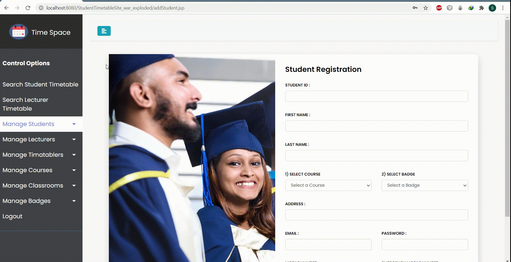

## Project High Level Diagram

<!---->

## 1. Web Application Features
**<U>GENERAL FEATURES
</U>**
- **Login**

    <small>Common for All User types : admin, timetabler, lecturer, student. Email formats:
        
    student - CBxxxx@domain.com
        
    lecturer - LExxxx@domain.com
        
    timetabler - TIxxxx@domain.com
        
    admin - xxxxx@domain.com</small>
- **Logout**

**<U>ADMIN LEVEL FEATURES
</U>**
- **Manage Admin Users (Add / Edit / Delete)**

    <small>Users with administrator level access is added/edited/removed from the database directly as precaution of not creating users with admin privileges from the UIs.</small>
- **Manage Student**

    o Add Student
    
    o Search Student
    
    o Edit / Remove Student
    
- **Manage Lecturer**

    o Add Lecturer
  
    o Search Lecturer
     
    o Edit / Remove Lecturer
      
- **Manage Timetabler** 
    
    <small><b><i>**Timetabler -** User who manages timetables/schedules</i></b></small>

    o Add Timetabler

    o Search/Edit / Remove Timetabler

- **Manage Course**

    o Add Course

    o Add New Module

    o Search/Edit/Delete Course

    o Search/Edit/Delete Module

- **Manage Classroom**

    o Add New Classroom

    o Search/Edit/Delete Classroom

- **Manage Badges**

    o Add New Badge

    o Search/Edit/Delete Badge

**<u>TIMETABLER LEVEL FEATURES</u>**

- **Manage Timetables**

    o Create New Timetable
    
    <small>A timetabler can create a timetable for a particular course’s badge using the UI provided. The
    need to enter the below inputs:
    
    ✓ Start Time
    
    ✓ Duration
    
    ✓ Module (each day)
    
    Creating a badge timetable will automatically create / update the lecturer's timetable accordingly. If a badge have a timetable then the timetabler can’t create another one for the same badge unless
    he delete it.</small>

    o Search /Delete Student Timetable
    
    o Search Lecturer Timetable

<u>**STUDENT LEVEL FEATURES**</u>

- **Search Student Timetable**

- **Search Lecturer Timetable**

## 2. Web Application Overview

**Login View** 

  
  <!---->
    
o Search Student Timetable

<!---->
    

o Manage Students

*  Add a New Student

<!---->

*  View / Edit / Delete a Particular Student

<!---->

